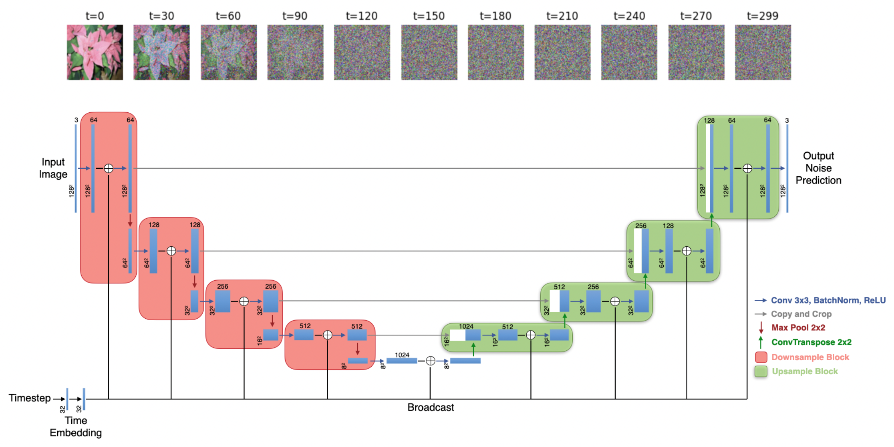
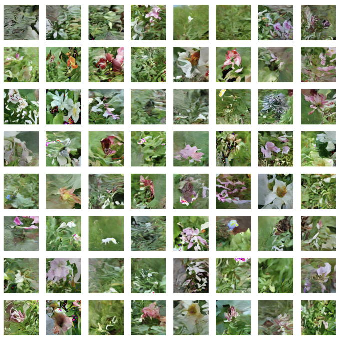

# FocusFusion

📊🔬🤖🚀

Welcome to the FocusFusion repository! This repository contains the codebase for Diffusion Model with attention implementation. This codebase is part of a larger project that conducts a detailed analysis of the performance comparison between various generative models. Please see the presentation video [here](https://www.youtube.com/watch?v=yZ9bIT23XEw). 

## File Structure

FocusFusion/  
│  
│── data/  
│ └── Flowers102  
│ └── Pokemon  
│  
│── README.md  
│── dataset.py  
│── diffusion_model.py  
│── inference_diffusion_model.py  
│── train_diffusion_model.py  
│── utils.py  

## Description

This project focuses on the implementation of Diffusion Models with the attention mechanism added to the model structure. We provide implementations for various components, including dataset preparation, model training, and inference.

## Installation

To run the code in this repository, you'll need to install the dependencies specified in `requirements.txt`:

You can install the required packages using pip:
```
pip install -r requirements.txt
```

## Usage

To use the code in this repository, follow these steps:

1. **Dataset Preparation**:  
Include the all the training images under a subdirectory in the data directory. Use the `dataset.py` script to define your dataset. Also make sure to add relevant code snippets to `train_diffusion_model.py` in order to support the newly defined dataset. Sample datasets, including the Oxford Flowers dataset and the Pokemon dataset are included and defined in the codebase for use. 

2. **Model Training**:  
Train the diffusion model using the `train_diffusion_model.py` script. The list of arguments are included in the argument parser of the script. Adjust the hyperparameters as needed and specify the dataset directory. The code can be run directly to use the default arguments provided in the script. By default, the model will be trained on the Oxford Flowers dataset. 
```
python train_diffusion_model.py
```

3. **Inference**:  
Use the trained model for inference using the `inference_diffusion_model.py` script. The list of arguments are included in the argument parser of the script. Provide the path to the training data in order to calculate the evaluation metrics. The code can be run directly to use the default arguments provided in the script. By default, the model will be evaluated and inferenced on the Oxford Flowers dataset. 
```
python inference_diffusion_model.py
```

## Model Architecture

A figure of the diffusion forward process and the diffusion model archtecture is shown below.



## Generated Samples 

Sample images generated from training the diffusion model on the Oxford Flowers dataset are shown in the following figure.



## Contributing

Contributions to this project are welcome! If you'd like to contribute, please follow these guidelines:

- Fork the repository
- Create a new branch for your feature or bug fix
- Make your changes and commit them with descriptive messages
- Push your changes to your fork
- Submit a pull request to the main repository

Feel free to reach out at [ericsuece@cmu.edu](mailto:ericsuece@cmu.edu) for any questions, discussions, or collaboration opportunities!